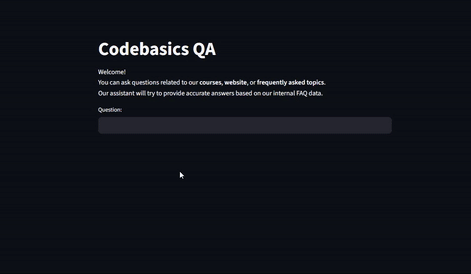

# 🤖 QA — RAG with Gemini 2.5 Flash

This project is a simple **question-answering app** powered by **Google’s Gemini 2.5 Flash model** and built using a **Retrieval-Augmented Generation (RAG)** approach. The goal is to answer user queries based on a custom knowledge base (a CSV file).

It uses:
- 🧠 `langchain` for chaining and retrieval
- 🔎 FAISS for vector similarity search
- 💬 Gemini 2.5 Flash for generating answers
- 📊 A real dataset from Codebasics
- 🎈 Streamlit for the UI

---
## Demo

  
  
## 📂 Dataset

We use the following CSV file from the Codebasics GitHub repository:

> [`codebasics_faqs.csv`](https://github.com/codebasics/langchain/blob/main/3_project_codebasics_q_and_a/codebasics_faqs.csv)

Copy this file and upload it into your Colab environment before running the app.

---

## 🚀 How to Run the App in Colab

1. **Open the Colab notebook** 
2. **Upload the `codebasics_faqs.csv` file** into Colab's working directory
3. **Create your own API keys**
   - In the `.env` file, write your own `GOOGLE_API_KEY` and `Ngrok_TOKEN`. You can obtain them from [Google AI Studio](https://makersuite.google.com/) and [Ngrok dashboard](https://dashboard.ngrok.com/get-started/your-authtoken).
4. **Run Colab**
5. **Open your Ngrok link in a browser**
   - You should open your own server's link, which looks something like this: `https://eb1d-104-196-101-220.ngrok-free.app`
